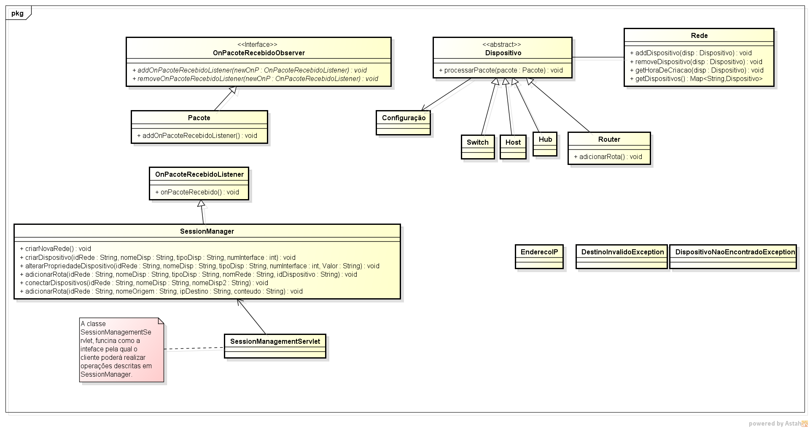

*********************
Para Desenvolvedores
*********************

Visão geral sobre arquitetura do Simulador
==========================================
A arquiteruta do atual projeto é cliente-servidor. Desta forma a aplicação do cliente irá ter a responsabilidade de fazer chamadas AJAX(uma técnica de fazer chamadas ao servidor), para o servidor para criar a rede. A idéia é que o cliente e o servidor fiquem sincronizados, para que quando o usuário executar algum comando no cliente, o servidor possa responder com a resposta correta.

A construção do projeto usando essa arquitetura foi imposta, pois os participantes do desenvolvimento do projeto não possuíam pleno conhecimento da linguagem JavaScript, para que ela fosse construída.

Estrutura de arquivos
==============================
O simulador está dividido em uma séria de diretórios.
	
	* `Docs/`		Nesse diretório está localizado todos os documentos relacionados a documentação. 
	* `Docs/source/` 		Neste diretório dentro da pasta Docs, está a documentação criada com Sphinx. Para mais detalhes de como manusear, visite: http://sphinx.pocoo.org
	* `Docs/build/html/`		Neste diretório está a documentação em HTML gerada pelo Sphinx. Também é possível gerar PDF, EPUB, entre outros formatos.
	* `src/`	Código fonte java, que irá rodar no servidor.
	* `WebContent/`		Codigo HTML, JavaScript, CSS, que irá funcionar no cliente.
	* `WebContent/WEB-INF/`	Libs .jar que serão usadas pelo codigo fonte java.
    
Diagrama de Classe do Servidor
==============================

Abaixo está o diagrama de classes da parte do core do projeto que é executada no servidor.

Funcionamento do Cliente
=========================
	Como já dito, o cliente  funciona com o uso de ajax. Cada objeto construído no cliente irá ser enviado para o servidor. 
	
	* Abaixo exemplo de código para a chamada do ping no Servidor:
	
	$(document).ready(function(){

		$("#enviar_ping").click(function(){	
			
			if($(this).attr("data-id") != ""){
				
				$.ajax({
					type: 'POST',
					url: 'SessionManagerServlet',
					data: {
							"operacao" : "processarpacote",
							"idRede" : sessionId,
							"nomeOrigem" : $(this).attr('data-id-origem'),
							"ipDestino" : "192.168.0.1",
							"conteudo" : "1"
							
						  },
					dataType: 'json'

				}).done(function(resposta){
					
					$("#text_terminal").append(resposta.retorno + "\n");
					
				});	
			}
		
		});
	});
